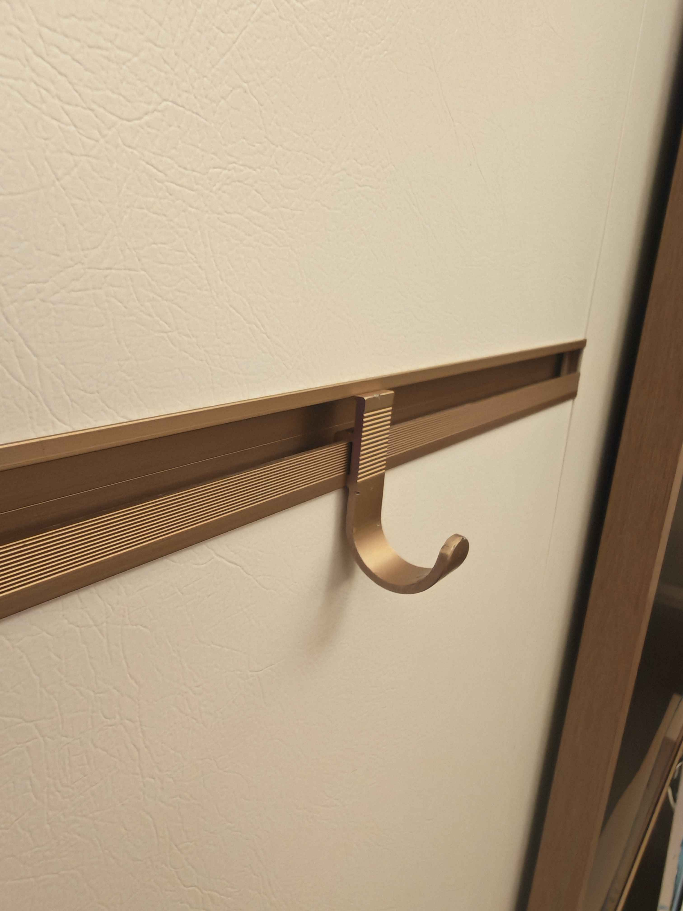

# 墙板轨道挂钩

[English](README.md)

这是一个面向友邦挂挂墙平行系列墙板轨道的参数化、可 3D 打印挂钩项目。项目把已经试装过的轨道卡爪接口沉淀为可复用 OpenSCAD 库，并在其上构建可替换的配件主体。



## 当前模型

| 模型 | 文件 | 用途 |
|---|---|---|
| 经典款 | `hooks/hook-classic.scad` | 基于原始轮廓的 17 mm 跨度 J 勾 |
| 宽 25 款 | `hooks/hook-wide25.scad` | 25 mm 跨度 J 勾，长悬出位置采用 4.4 mm 加强杆身 |

两款模型都使用 [`lib/rail-mount.scad`](lib/rail-mount.scad)。它包含固定轨道接口、通用挤出模块，以及参数化 J 勾辅助函数。

## 适配范围与当前状态

- 轨道卡爪几何已在作者的友邦挂挂墙平行系列墙板轨道上完成试装。它是特定五金件的配合设计，不应假定能直接适配其他轨道。
- 固定接口采用 2.40 mm 后爪、2.75 mm 槽宽和 7.35 mm 安装头总深；这几个尺寸需要作为一个整体保留。
- v7 在两款正式挂钩中共享一段高 5 mm、总后伸 2.0 mm 的下方抵墙承压面，用于把一部分悬挂载荷转化为墙板压力。
- 当前模型均已渲染为流形实体。v7 承压面仍需要全宽实物确认完全就位，并进行承载测试后，才能依赖与抵墙接触相关的承载结论。

## 渲染模型

这些 `.scad` 文件可直接由 OpenSCAD 使用。在仓库根目录执行：

```bash
openscad -o hook-classic.stl hooks/hook-classic.scad
openscad -o hook-wide25.stl hooks/hook-wide25.scad
```

项目也保留了用于验证的 Docker 渲染流程。完整命令和网格检查要求见 [项目 Skill](.agents/skills/wallboard-rail-mount/SKILL.md)。

## 打印建议

- 按模型姿态侧面朝下打印，截面位于 XY 平面。这样无需支撑，主要弯曲应力也留在层平面内。
- 长期承载请选择 PETG 或 ASA，PLA 容易蠕变。
- 功能测试建议至少 4 圈壁，或使用 100% 填充。
- 挂重物前先确认卡爪完全坐入轨道。应从轻载静置开始，检查蠕变、层间开裂和墙板压痕。

## 扩展设计

保持轨道接口固定，通过 `rail_accessory()` 构建新的配件主体：

```scad
include <../lib/rail-mount.scad>

body = j_hook_body(drop = 22.3, r_out = 8.5, r_in = 5.5);
rail_accessory(-22.3, body, w = 11.9);
```

自定义主体时，从下方抵墙承压面之后的 `(-pad_back, body_back_y)` 继续绘制 polygon（多边形）。如果主体起点太高、没有为承压面过渡留出空间，库会用 assert（断言）报错。

## 目录结构

```text
lib/rail-mount.scad                    共享、固定的轨道接口
hooks/hook-classic.scad                17 mm 经典 J 勾
hooks/hook-wide25.scad                 加强版 25 mm J 勾
raw/assets/                            参考照片
wiki/                                  测量、决策与验证历史
.agents/skills/wallboard-rail-mount/   可复用的设计与渲染工作流
```

## 项目文档

[`wiki/`](wiki/index.md) 保存测量、配合决策、强度审查和版本记录，重点包括：

- [模型版本史与 v7 集成](wiki/outputs/hook-scad-v1.md)
- [25 mm 挂钩尺寸说明](wiki/outputs/hook-wide25.md)
- [强度审查与限制](wiki/outputs/hook-strength-review.md)

## 许可

Copyright 2026 Tomcat。项目以 [MIT License](LICENSE) 发布。
