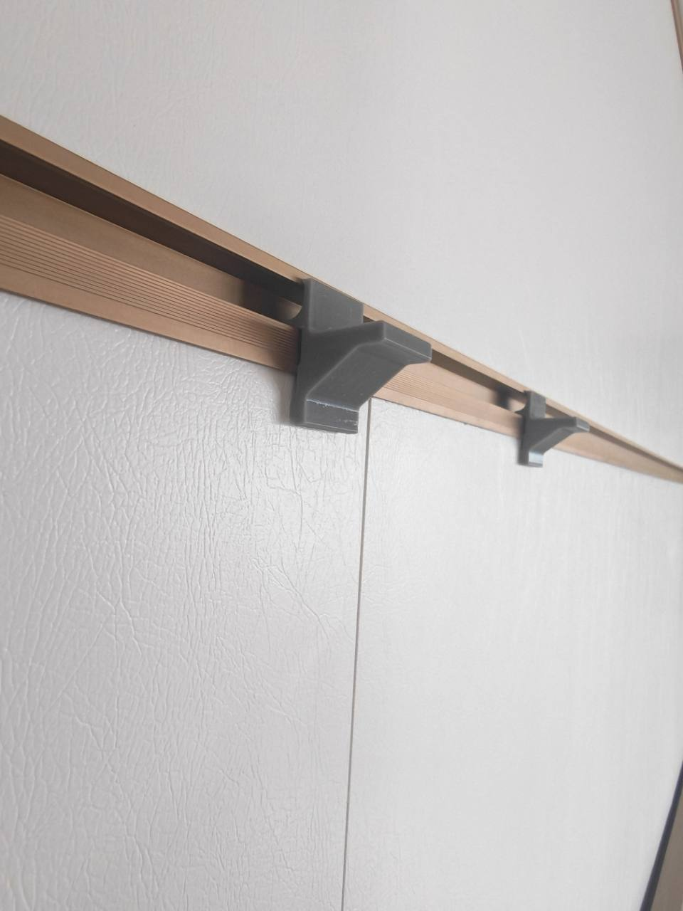
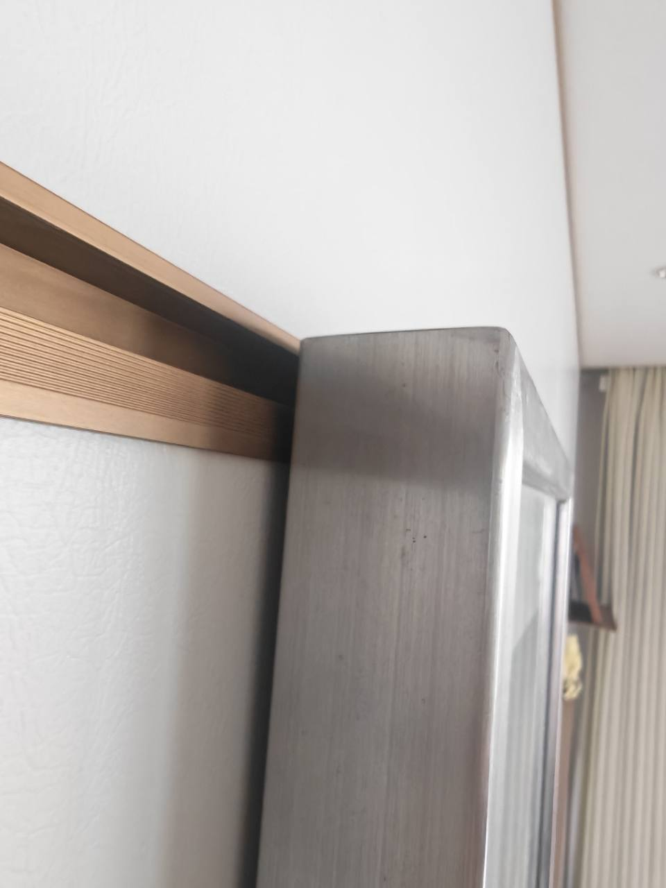

# IKEA RIBBA 22 mm Recessed-Back Frame Saddle

## Evidence And Scope（证据与范围）

- EN: The user's [label photo](../../raw/accessories/frame-ribba22/ribba-label.jpg) identifies an old IKEA RIBBA frame with code `18288` and a 1999 copyright line. The [full rear photo](../../raw/accessories/frame-ribba22/recessed-back.jpg) shows a flat hardboard panel recessed inside the surrounding frame; the user measured that recess as 22 mm.
  ZH: 用户的[标签照片](../../raw/accessories/frame-ribba22/ribba-label.jpg)表明这是旧款 IKEA RIBBA 相框，代码为 `18288`，版权行标注 1999 年。[完整背面照片](../../raw/accessories/frame-ribba22/recessed-back.jpg)显示平直硬质背板凹入周围框体内部；用户实测该凹深为 22 mm。
- EN: The [existing-hook photo](../../raw/accessories/frame-ribba22/existing-flat-hook.jpg) confirms that a straight arm with a small upturned end can already carry the frame. Current official IKEA RIBBA instructions provide series context, but they have not been verified as the exact old `18288` construction; the user's photos and measurement therefore govern this prototype.
  ZH: [现有挂钩照片](../../raw/accessories/frame-ribba22/existing-flat-hook.jpg)证明平直托臂加小幅上翘末端已经能够承托相框。现行 IKEA RIBBA 官方说明书只能提供系列背景，尚未确认对应这款旧 `18288` 结构；因此本原型以用户照片和实测尺寸为准。

## Installed Result（实装效果）

EN: The current raised reinforced revision was printed as a pair and installed on the production rail. The photo records the selected spacing, full-width diagonal gussets, and both rail claws engaged before the frame covers them.
ZH: 当前抬高加强版已成对打印并安装到正式挂条上。照片记录了两只托架的实际间距、全宽斜撑，以及相框遮挡前两只卡爪均已挂入轨道的状态。

EN: With the RIBBA frame mounted, the side view shows the frame covering the saddles at the 12 mm visual datum. The user reports that the result works very well; no rail/frame interference or visible mount projection is apparent in this installed view.
ZH: 挂上 RIBBA 相框后，侧视照片显示相框在 12 mm 视觉基准处遮住托架。用户反馈效果很好；该实装视角未见轨道/相框干涉，也未见托架从相框外侧露出。

## Design Decision（设计决定）

- EN: Use two independent saddles spaced apart on the rail, rather than one long crossbar or two narrow generic hooks. Each saddle spreads the reaction over 24 mm of frame-back width, while the separated pair resists yaw and lets the position avoid the frame's retaining tabs.
  ZH: 采用两只彼此独立、在导轨上拉开间距的 saddle（托架），而不是一根长横梁或两只狭窄通用钩。每只托架在相框背面提供 24 mm 宽的承托反力面；两只分开后还能抑制左右偏摆，并可避开相框背面的固定压片。
- EN: The selected revision removes the upturned retaining lip. Its bearing surface rises 1.5° toward the room/free end, so the downhill direction under gravity is back toward the wall/root. This provides a gentle inward bias while avoiding frame interference and making insertion easier; unlike a lip, it is not positive retention against a strong bump or deliberate lift.
  ZH: 定案修订取消上翻防脱唇。承托面向房间侧/自由端抬高 1.5°，因此重力作用下的下坡方向回到墙面/根部，形成温和的向内偏置，同时减少相框干涉并便于插入；与上翻唇不同，它不能对明显碰撞或主动抬起形成 positive retention（刚性限位）。
- EN: Keep the main arm underside horizontal. The slope therefore increases arm thickness slightly toward the free end instead of thinning the load path. An R1.2 tangent nose removes the upper sharp edge, while R1.0 radii round both exposed lower corners.
  ZH: 托臂主底面保持水平。这样斜面会让托臂厚度向自由端略微增加，而不是削薄传力路径。R1.2 相切圆头消除上方尖角，底部两处外露转角则均采用 R1.0 圆角。
- EN: The prior physically tested low-platform revision aligned its underside with the shared wall-contact lower edge at `Y=-21`. That revision is superseded by the current visual-cover version, but remains the source of the recorded first-print fit result.
  ZH: 先前已完成实物试装的低平台版本曾将底面与共享抵墙承压面下缘 `Y=-21` 对齐。该版本现已被当前遮挡优化版取代，但仍是已记录首件试装结果的对应版本。
- EN: Remove the former 2.2 mm room-side root thickening by setting `root_front_x=x_pf`, leaving one continuous vertical front face for this light picture-frame load. Add a tangent R1.0 fillet where that face meets the inclined platform; it softens the re-entrant corner without restoring a protruding boss.
  ZH: 通过设置 `root_front_x=x_pf` 删除原有 2.2 mm 房间侧根部加厚，使正面对于这项轻载相框用途保持连续垂直。在垂面与倾斜平台交界处增加相切 R1.0 圆角，缓和 re-entrant corner（内凹转角），但不恢复外凸加强块。
- EN: Raise the platform so its free bearing edge is exactly 12.0 mm below the unchanged fixed mount top (`Y=-0.8` versus `y_top=11.2`). Because this height lies within the fixed front-plate range, model the platform as a separate profile with 0.25 mm of positive overlap into the plate; the rear claw, 2.0 mm pressure face, `body_back_y=-22.4`, and 33.6 mm overall envelope remain unchanged.
  ZH: 将平台抬高，使自由端承托上缘精确位于未改动的固定安装头顶部下方 12.0 mm（`Y=-0.8`，`y_top=11.2`）。由于该高度已进入固定前板范围，平台改为独立轮廓，并向前板内实体重叠 0.25 mm；后方卡爪、2.0 mm 承压面、`body_back_y=-22.4` 与 33.6 mm 总包络均保持不变。
- EN: Reinforce the raised platform with a 24 mm full-width diagonal gusset whose nominal reach/drop is 13 × 10 mm. It overlaps the plate and platform by 0.6 mm, forming one closed solid whose internal material is controlled by slicer infill rather than by hollow geometry in OpenSCAD.
  ZH: 使用 24 mm 全宽斜撑加强抬高的平台，其标称伸出/下探为 13 × 10 mm。斜撑向竖板和平台各实体重叠 0.6 mm，形成一个闭合实体；内部用料由切片器填充控制，而不是在 OpenSCAD 中建空壳。
- EN: At both exposed gusset junctions, use tangent R1.5 concave inner arcs derived from the final union outline. The earlier experiment that rounded a standalone triangle with a generic offset is superseded: after union it produced an outward bulb at the obtuse/re-entrant platform junction instead of the intended inner fillet.
  ZH: 斜撑两处外露接头均按最终 union（并集）轮廓构造相切 R1.5 内弧。先对独立三角形做通用 offset（偏移）圆角的早期尝试已作废：并集后它会在平台的钝角/内凹接头形成向外鼓包，而不是目标内圆角。

## Prototype Dimensions（原型尺寸）

| Parameter | Value | Rationale |
|---|---:|---|
| `part_w` | 24.0 mm | Bearing width per saddle; use two |
| `recess_depth` | 22.0 mm | User's physical measurement |
| `depth_clearance` | 0.0 mm | User-selected compact reach |
| Flat bearing reach from frame rear plane | 22.0 mm | Ends at the measured recess before rounding begins |
| Rounded outer reach from frame rear plane | 23.231 mm | R1.2 tangent nose only; not additional flat bearing length |
| `platform_t` | 4.5 mm | Root platform thickness; intentionally distinct from fixed mount `arm_t` |
| `surface_angle` | 1.5° | Free end higher; gravity bias points inward |
| `surface_rise` | 0.466 mm | Rise across the 17.8 mm bearing run |
| `nose_r` | 1.2 mm | Tangent rounded end, no upturn |
| `root_fillet_r` | 1.0 mm | Tangent root stress-relief fillet |
| `bottom_fillet_r` | 1.0 mm | Root underside and free-end lower corner |
| `gusset_reach` | 13.0 mm | Nominal horizontal reach from the front plate |
| `gusset_drop` | 10.0 mm | Nominal drop below the platform underside |
| `gusset_overlap` | 0.6 mm | Positive-volume connection into plate and platform |
| `gusset_fillet_r` | 1.5 mm | Tangent concave inner arcs at both exposed junctions |
| `platform_top_gap` | 12.0 mm | Free bearing edge below the fixed mount top |
| Free bearing edge `Y` | −0.800 mm | `y_top - platform_top_gap` |
| Root nominal top `Y` | −1.266 mm | Before the upper R1 tangent fillet |
| Root fillet highest `Y` | −0.239 mm | 11.440 mm below the fixed top |
| Main platform underside `Y` | −5.766 mm | Horizontal segment between the lower radii |
| Lowest root-underfillet `Y` | −6.766 mm | R1.0 root underside radius |
| `platform_overlap` | 0.25 mm | Positive-volume overlap into the fixed front plate |
| Front extra beyond fixed plate | 0.0 mm | Continuous vertical front face |
| Fixed lower connection | −22.4 mm | Unchanged rear ramp/body datum |
| Overall vertical envelope | 33.6 mm | From fixed `body_back_y` to fixed `y_top` |

EN: In vertical terms, the free bearing edge is 12.0 mm below the fixed top, the upper R1 root reaches to an 11.440 mm gap, and the main underside is at `Y=-5.766`. The diagonal gusset's theoretical sharp root datum is 10.0 mm lower at `Y=-15.766`, before its tangent R1.5 inner arcs; the rear datum and overall envelope do not move.
ZH: 竖向尺寸上，自由端承托上缘距固定顶部 12.0 mm，上方 R1 根部圆角最高处的间距为 11.440 mm，主底面位于 `Y=-5.766`。斜撑的理论尖角根部基准再向下 10.0 mm，位于 `Y=-15.766`，随后由相切 R1.5 内弧取代；后方基准与总包络均不移动。

EN: The inclined flat now ends exactly 22.0 mm from the frame rear plane. Only the tangent R1.2 nose continues to 23.231 mm, so the extra 1.231 mm is a curved edge transition rather than usable flat platform length. Physical fit decides whether that rounded overrun needs reduction.
ZH: 倾斜平直托面现在精确终止于距相框背面基准 22.0 mm 的位置。只有相切 R1.2 圆头继续到 23.231 mm，因此多出的 1.231 mm 是曲面边缘过渡，不是可用平直平台长度。该圆头越界是否还需缩小，以实物试装为准。

## First-Order Strength Check（一级强度检查）

- EN: Treating the unreinforced root platform alone as a 24 × 4.5 mm rectangular section gives `Z = b h² / 6 = 81 mm³`. For illustration only, a 5 kg total load shared equally by two saddles with a conservative 20 mm lever gives about `6.1 MPa` nominal bending stress before print defects, creep, impact, stress concentration, rail seating, or safety factors. The current full-width gusset changes and shortens this load path, so this bare-arm calculation is retained only as conservative historical context, not as a prediction of local gusset stress.
  ZH: 仅将未加强的根部平台按 24 × 4.5 mm 矩形截面估算，得到 `Z = b h² / 6 = 81 mm³`。仅作量级示例：若 5 kg 总载荷由两只托架平均承担，并保守取 20 mm 力臂，名义弯曲应力约为 `6.1 MPa`；该数值尚未计入打印缺陷、蠕变、冲击、应力集中、导轨就位状态或安全系数。当前全宽斜撑会改变并缩短传力路径，因此这项裸托臂计算只保留为保守的历史背景，不能预测斜撑局部应力。
- EN: This calculation is not a load rating. The 0.6 mm positive gusset overlap and tangent R1.5 inner arcs remove face-only contacts and sharp re-entrant corners. The raised reinforced revision now has a successful fit and installation result, but no FEA or controlled progressive load test; continued observation is still required.
  ZH: 该计算不是承载额定值。斜撑 0.6 mm 的实体重叠与相切 R1.5 内弧消除了仅共面接触和尖锐内凹角。抬高加强版现已成功试装并投入挂装，但尚未进行 FEA（有限元分析）或受控逐级承载测试，仍需继续观察。

## Print And Use（打印与使用）

- EN: Print side-face-down as modeled. The full profile, including the gusset, touches the bed, so supports are not required. The gusset is intentionally modeled as a thick closed volume; use PETG or ASA, at least four perimeters, and let the slicer's infill setting control its internal material.
  ZH: 按模型姿态侧面朝下打印。包括斜撑在内的完整截面均接触热床，因此无需支撑。斜撑有意建成厚实闭合体；建议使用 PETG 或 ASA、至少 4 圈壁，并由切片器填充设置控制内部用料。
- EN: Use two saddles, place them symmetrically and as far apart as practical while avoiding rear retaining tabs, then confirm both rail claws are fully seated before loading the frame.
  ZH: 使用两只托架，尽量对称并拉开间距，同时避开背面固定压片；挂上相框前先确认两只导轨卡爪都已完全坐入。
- EN: First test empty fit, then the frame under close observation, then a longer static hold. Check that the rounded nose clears the frame, the 1.5° surface biases the frame inward without visible lean, and there is no hardboard edge damage, rail unseating, layer separation, or creep.
  ZH: 先进行空载配合，再在近距离观察下挂入相框，最后延长静置时间。确认圆头避开框体、1.5° 托面能让相框向内贴靠且不会产生可见倾斜，并检查硬板边缘损伤、导轨脱位、层间开裂与蠕变。

## Verification（验证）

- EN: Impact-scoped validation rendered only the current raised and reinforced `accessories/frames/ribba-22.scad`. Docker `scad-render` completed without warnings or assertions and reported `Manifold`, `NoError`, and genus 0. Enlarged side-profile inspection confirmed tangent concave R1.5 inner arcs at both the plate-to-diagonal and diagonal-to-platform junctions, with no outward bulb. A direct STL audit found one connected component, zero boundary/non-manifold edges, Euler characteristic 2, 228 vertices, and 452 triangles. Echoes confirm the 13 × 10 mm gusset, 12.0 mm free-edge top gap, main underside `Y=-5.76611`, exact 22 mm flat reach, 23.2314 mm rounded outer reach, unchanged 33.6 mm overall envelope, and unchanged 2.0 mm rear pressure face.
  ZH: 按影响范围仅渲染当前抬高加强版 `accessories/frames/ribba-22.scad`。Docker `scad-render` 零 warning、零 assertion，并报告 `Manifold`、`NoError` 与 genus 0。放大侧轮廓检查确认竖板—斜面、斜面—平台两处均为相切 R1.5 内弧，且没有向外鼓包。直接 STL 检查得到 1 个连通体、0 条边界/非流形边、Euler characteristic（欧拉特征数）2、228 个顶点与 452 个三角面。echo 确认 13 × 10 mm 斜撑、自由端距顶部 12.0 mm、主底面 `Y=-5.76611`、平直托面精确伸入 22 mm、圆头最外缘伸入 23.2314 mm、33.6 mm 总包络不变，且后方 2.0 mm 承压面不变。
- EN: On 2026-07-15, the user reported that the preceding low-platform revision printed successfully and mounted the old RIBBA 18288 frame. That result validates the unchanged rear interface and selected reach for this setup, but does not yet validate the current platform height, lower fillets, visual coverage, or a long-term load rating.
  ZH: 2026-07-15，用户反馈前一个低平台版本已成功打印，并已挂上旧款 RIBBA 18288 相框。该结果验证了这套组合中未改动的后方接口与选定伸入量，但尚未验证当前平台高度、底部圆角、视觉遮挡效果或长期承载额定值。
- EN: Later on 2026-07-15, the user also printed and installed the current raised reinforced pair. The [installed-pair photo](../../raw/accessories/frame-ribba22/raised-reinforced-pair-installed.jpg) confirms the revised body can be used as a spaced pair on the rail, while the [concealment photo](../../raw/accessories/frame-ribba22/frame-conceals-raised-saddles.jpg) confirms the frame hides the mount at the selected 12 mm datum. This closes the current fit and visual-coverage checks for this specific setup, but is not a sustained-load rating.
  ZH: 同在 2026-07-15，用户进一步打印并安装了当前抬高加强版成对托架。[成对安装照片](../../raw/accessories/frame-ribba22/raised-reinforced-pair-installed.jpg)确认修订主体可在该挂条上拉开间距使用，[遮挡效果照片](../../raw/accessories/frame-ribba22/frame-conceals-raised-saddles.jpg)则确认相框能在选定的 12 mm 基准处遮住托架。由此关闭这套特定组合下的当前配合与视觉遮挡检查，但不构成持续承载额定。
- EN: The body thickness variable was renamed from `arm_t` to `platform_t`. With OpenSCAD `include`, the old name shadowed the fixed library's `arm_t=2.2` and inflated the rail claw to 11.25 mm. The corrected render reports claw total 8.95 mm against the 9.0 mm target, restoring the fixed interface without changing the shared library.
  ZH: 主体厚度变量由 `arm_t` 改名为 `platform_t`。在 OpenSCAD `include`（包含）作用域中，旧名称会遮蔽固定库的 `arm_t=2.2`，曾把导轨卡爪意外增高到 11.25 mm。修正后渲染回显卡爪总高 8.95 mm，对应 9.0 mm 目标；无需修改共享库即可恢复固定接口。
- EN: This model explicitly uses `ch=0`. During diagnosis, the current shared stepped-chamfer helper produced a top chamfer shell that only touched the center extrusion at a coplanar face, so it was not used here. Repairing that shared helper is separate interface-library work and would require full accessory regression.
  ZH: 本模型显式使用 `ch=0`。诊断时发现当前共享阶梯倒角 helper（辅助模块）会生成一层仅与中心挤出体共面接触的顶部倒角壳，因此本模型不使用该倒角。修复共享 helper 属于独立的接口库工作，并会要求执行全部配件回归。
- EN: Open item: continue observing the installed raised pair for creep, layer separation, rail unseating, hardboard-edge marking, or visible outward lean. The fit and 12 mm visual-coverage goals are now validated for this setup, but no sustained-load rating is assigned.
  ZH: 开放项：继续观察已安装的抬高版成对托架是否出现蠕变、层间开裂、导轨脱位、硬质背板边缘压痕或可见外倾。这套组合下的配合与 12 mm 视觉遮挡目标现已验证，但仍不赋予持续承载额定值。
